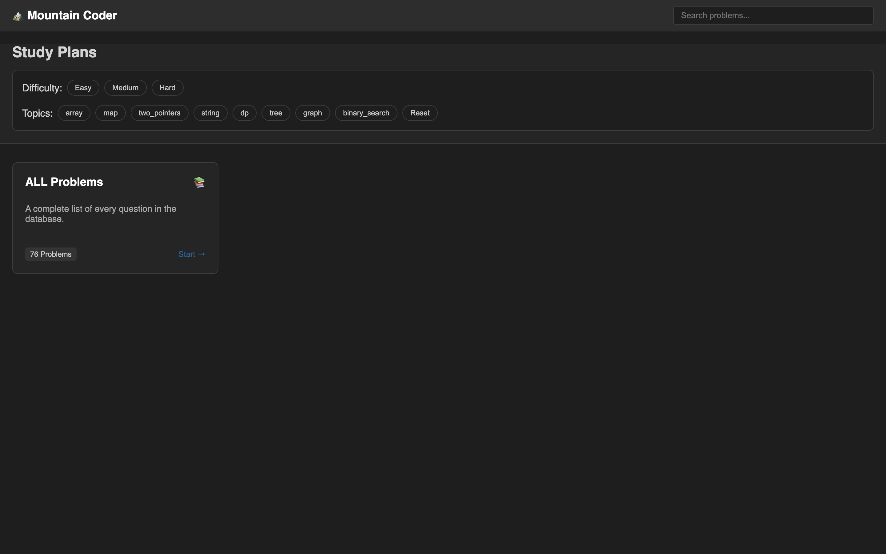
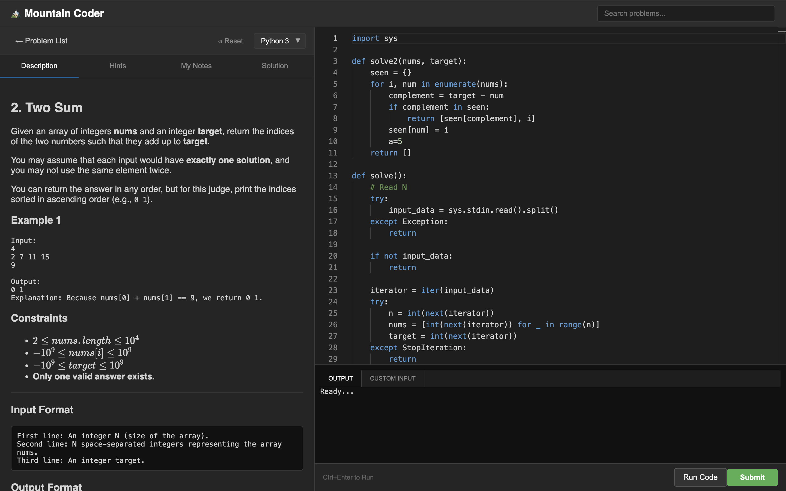
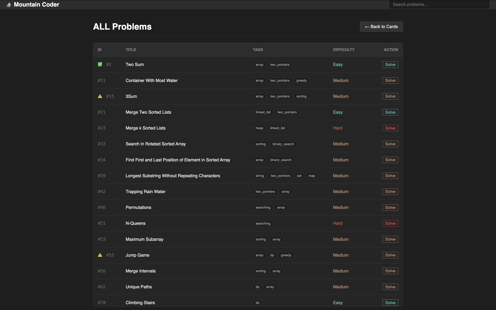

# 🏔️ Mountain Coder

**The Offline-First, Dockerized Coding Interview Platform.**

Mountain Coder is a self-hosted, full-stack application designed for practicing data structures and algorithms (DSA) **locally**. It replicates the interview experience and online flows judges like leetcode and hackerrang with a focus on privacy, offline capability, and raw performance.

It features a **"Serverless-State" architecture**, meaning your progress, code history, and notes are stored entirely in your browser (LocalStorage), keeping the backend stateless and blazing fast.

---

## 📸 Screenshots

| **Dashboard & Study Plans** | **IDE & Engineering Notebook** |
|:---------------------------:|:------------------------------:|
|  |  |
| *Filter by topic, difficulty, or search.* | *Monaco Editor with real-time feedback.* |
|  |
| *QuestionBank*  |


---

## 🚀 Key Features

* **🔒 Secure Sandbox:** Runs user code (Python & Java) inside isolated Docker containers using a robust Judge system.
* **⚡ Offline-First Design:** All assets (including the Monaco Editor) are bundled locally. Practice without internet.
* **🧠 Engineering Notebook:** Built-in tab to write pseudocode, complexity analysis, or notes alongside your solution (Auto-saved).
* **💾 Smart State:**
    * **Auto-Save:** Code is saved to your browser instantly as you type.
    * **Progress Tracking:** Tracks "Solved" ✅ and "Attempted" ⚠️ status without a database user session.
* **🛠️ Developer Experience:** One command setup. Automated data ingestion pipeline loads questions on startup.

---

## 🛠️ Tech Stack

* **Frontend:** Vanilla JavaScript (ES6+), CSS3 Variables (Dark Mode), Monaco Editor.
* **Backend:** Python 3.12, FastAPI, Uvicorn.
* **Execution Environment:** Docker (Alpine/Slim containers).
* **Database:** SQLite / SQLAlchemy.

---

## 🏁 Getting Started

### Prerequisites
* [Docker Desktop](https://www.docker.com/products/docker-desktop/) installed and running.

### Installation

1.  **Clone the repository**
    ```bash
    git clone [https://github.com/pragmaticdesign-dev/mountain-coder.git](https://github.com/pragmaticdesign-dev/mountain-coder.git)
    cd mountain-coder
    ```

2.  **Build and Run**
    Run the application using Docker Compose. This automates everything (Server start + Data Import).
    ```bash
    docker-compose up --build
    ```

3.  **Access the App**
    Open your browser and navigate to:
    ```
    http://localhost:8000
    ```

---

## 📂 Project Structure

```text
mountain-coder/
├── app/
│   ├── routers/        # API Endpoints (Judge, Questions)
│   ├── utils/          # Docker Sandbox Logic
│   ├── static/         # Frontend Assets (JS, CSS, Monaco)
│   └── templates/      # HTML Files
├── import_data/        # JSON Question Data (Auto-imported)
├── import_script.py    # Script to load data into DB
├── Dockerfile          # Container definition
├── docker-compose.yml  # Orchestration
└── requirements.txt    # Python dependencies